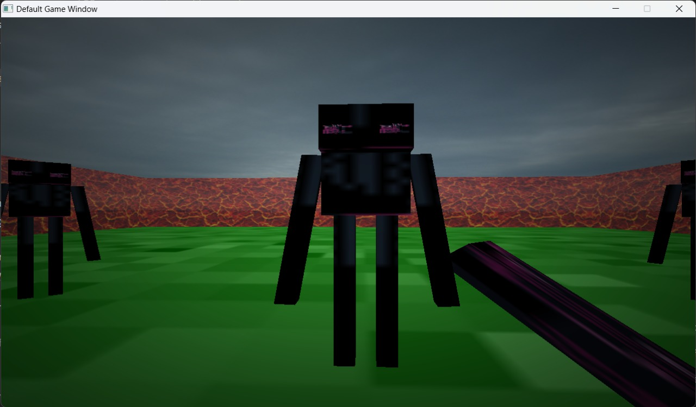
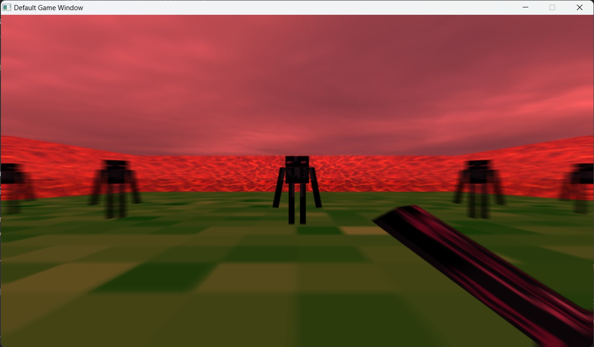
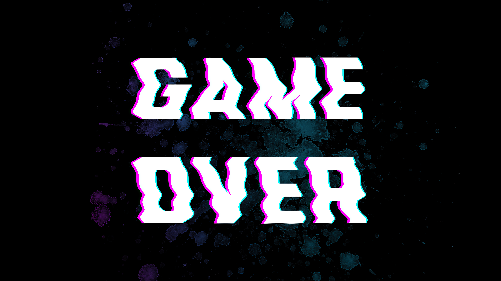

# Zombie Village Game

Zombie Village is a game themed around the zombie apocalypse in a minecraft-like world. The game is built using a custom game engine that we have developed for this project. The game engine is designed to be modular and extensible, and can be used to build other games. It is built using openGL and C++.

## Table of Contents

1. [Overview for the game](#overview-for-the-game)
1. [Game Screenshots](#screenshots)
1. [How to run the game](#how-to-run-the-game)
1. [Game Engine Overview](#game-engine-overview)
1. [Credits](#credits)
1. [Contributers](#contributers)
1. [Contributing to the game](#contributing-to-the-game)

## Overview for the game

A zombie apocalypse has struck the world due to a mistake by a crazy scientist who was trying to reverse-enginner a virus. Accidentally, he created a virus that turned everyone into zombies. The world is now in chaos and the only hope for humanity is to survive the zombie apocalypse. You are one of the survivors and you have to survive the zombie apocalypse. You have been locked up in a village with a few other survivors. Lava has erupted from the ground and created a huge wall of lava that locked you up alone with the zombies. Luckily, you have found a "valeryan steel" sword hidden in your grandparents room which could kill the zombies. If you are smart enough to avoid the lava and kill the zombies, you will be able to survive the day. However, you and your village won't be safe forever, as zombies will keep coming and the lava will keep rising till you find a cure for that virus. But, that's will be left for another update of the game ... :)


## Screenshots





## How to run the game

The game is built using the custome engine which is written using openGL and C++. It has been tested on Windows and Linux. To run the game, you need to have openGL installed on your system.

To build the game files from the source, you need to have CMake tool installed on your system. You can download CMake from [here](https://cmake.org/download/). After you have CMake installed, you can build the game by following these steps:

1. Clone the repository or download the zip file from the github website
1. Run `cmake .` in the root directory of the repository in the terminal
1. Run `./bin/GAME_APPLICATION.exe -c='config/light-test.jsonc` to run the game.

```
git clone https://github.com/Khalidmamdou7/zombie-village.git
cd zombie-village
cmake .
./bin/GAME_APPLICATION.exe -c='config/light-test.jsonc
```


## Game Engine Overview

The game engine is built using openGL and C++ and is cross-platform. It has been tested on Windows and Linux. It is designed to be modular and extensible. It uses the Entity-Component-System (ECS) architecture to model the game entities. 

To build the game engine from source, you could follow the same steps as the ones used to build the game.

To use the game engine to build your own game, you can follow these steps to add your game logic:

1. Create new classes that inherit from the `State` class to model your game states. You can use the `PlayState` class as a template for your game states.
1. Create new classes that inherit from the `Component` class to model your game components. You can use the `TransformComponent` class as a template for your game components.
1. Create new classes that inherit from the `System` class to model your game systems. You can use the `RenderSystem` class as a template for your game systems.
1. Create your own shaders and textures to use in your game. You can use the `shaders/vertex.glsl` and `shaders/fragment.glsl` files as a template for your game shaders. You can use the `textures/texture.png` file as a template for your game textures.
1. Create you json config file to configure your game. You can use the `config/light-test.jsonc` file as a template for your game config file.

Can't wait to see what you build with the game engine, so please share your game with us! :)

## Credits

- [Dr Yahia Zakaria](https://github.com/yahiaetman) 
- [Eng. Bassel Mostafa](https://github.com/bassel97)

Thanks to them for their help in instructing us about computer graphics and game development. Also, The boilerplate code for the game engine was provided by them.

## Contributers

- [Seif AlBaghdady](https://github.com/seifAlbaghdady)
- [Ahmed Maher](https://github.com/AhmedMaher309)
- [Malak Mokhtar](https://github.com/Malak-Mokhtar)
- [Khaled Mamdouh](https://github.com/Khalidmamdou7)

## Contributing to the game

Contributions are very welcome! If you want to contribute to the game, you can do so by following these steps:

1. Fork the repository
1. Create a new branch for your feature
1. Commit your changes
1. Push your changes to your fork
1. Create a pull request
1. Wait for your pull request to be reviewed and merged
1. Congratulations! You have contributed to the game! Contact us to get your name added to the contributers list!